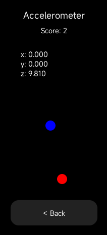
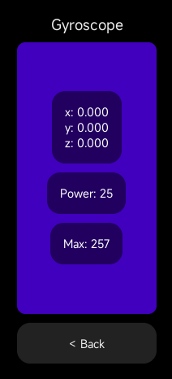
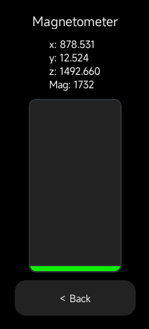
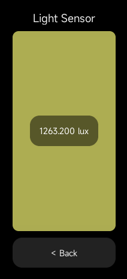
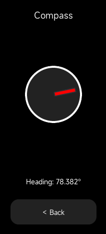
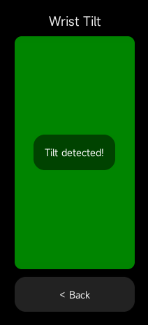
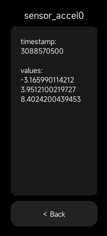

# Sensor Test for Mi Band 10

Test your Mi Band 10 sensors with **tiny games**!

## Installation
[Here's](https://www.youtube.com/watch?v=TCJuQgy0E74) a video tutorial about installing custom apps.

## Known Sensors
- Accelerometer, Gyroscope, Magnetometer, Light Sensor, Compass, Wrist Tilt

## All Sensors (Reading Raw Values)
You can read raw values from sensors.\
Valid parsing isn't guaranteed though.

### Force Reset Warning
>  Some sensors might **freeze** or **restart your band** when used.

If your Mi Band **completely freezes**:
1. Connect the charger.
2. Quickly **plug and unplug 10 times in a row**.

[Here's](https://youtu.be/TCJuQgy0E74?t=317) a quick video demonstration